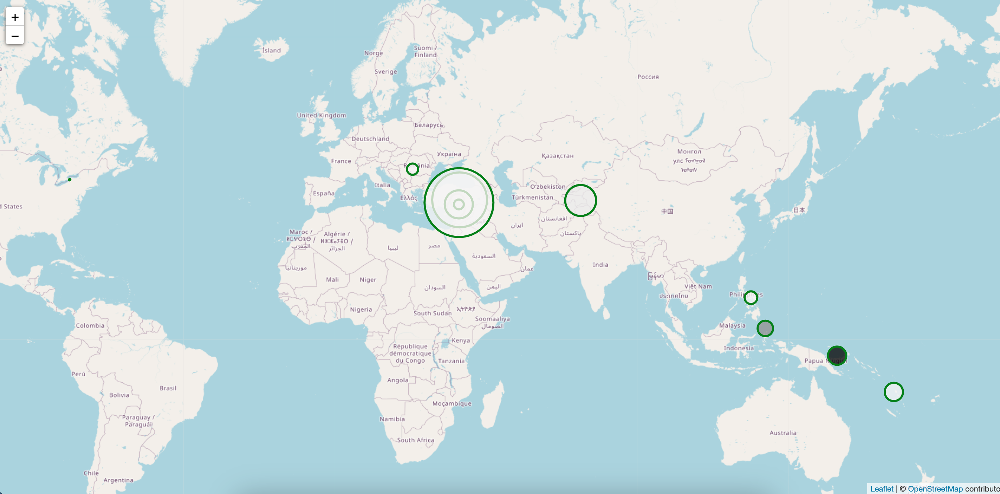

# leaflet-challenge
- - -

- - -
## **Project Structure:**
## **Background:**
This project was completed as part of the UT Austin Data Analytics bootcamp. This dashboard shows the most significant earthquakes around the world over the past month 

Relevant Files:
- [logic.ls](Leaflet-Part-1/logic.js)
  - Javascript file containing the code to create the map and add the earthquake data to the map
- [index.html](Leaflet-Part-1/index.html)
  - HTML file that loads logic.js and other scripts

## How to Run the App

1. Clone the leaflet-challenge repo to your computer.
   - [How to Clone Github Repo](https://docs.github.com/en/repositories/creating-and-managing-repositories/cloning-a-repository)

2. Open the Leaflet-Part-1 folder in VS Code on your personal computer (or another application of your choice).

3. Right click to open index.html in your browser. 

# How to read the map

1. Earthquakes appear as circles outlined in green. The larger the radius, the higher the earthquake's magnitude. 
2. Deep earthquakes have darker, blacker centers. 
3. Shallow earthquakes have lighter, whiter centers. 

## Resources:
Earthquake Data: [Spotify Weekly Top 200 Songs Streaming Data](https://earthquake.usgs.gov/earthquakes/feed/v1.0/summary/significant_month.geojson)

More information on the earthquake data can be found [here](https://earthquake.usgs.gov/earthquakes/feed/v1.0/geojson.php). 

Map tiles provided by [Open Street Map](https://www.openstreetmap.org/)
